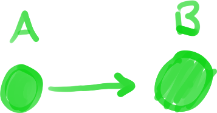
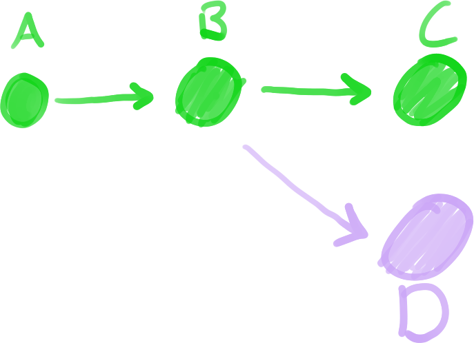
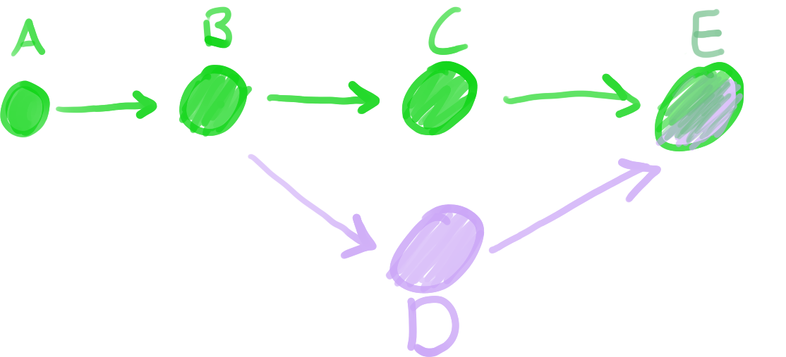

### İçerik
1. Git'e Giriş
    1. [Versiyon Kontrol Sistemi](#1i-versiyon-kontrol-sistemi)
    2. [Git](#1ii-git)
2. [Temel Git Kullanımı](02-kullanim.md)
3. [Git ile İşbirliği](03-isbirligi.md)
---

# 1. Git'e Giriş

Bu bölümde Git'in ne olduğunu, ne işe yaradığını ve Git'in çalışmasını sağlayan temel önemli konseptleri ele alacağız.

## 1.i. Versiyon Kontrol Sistemi

Bir yazılım projesinin kodlanması esnasında ve projenin ömrü boyunca dosyaların nasıl depolanacağı
sürekli bir problem olmuştur. İnsanların sunuculardan bağımsız çevrimdışı çalışabilmeleri,
birbirlerinden bağımsız parçalarda kodlar yazıp bunları birleştirebilmeleri, ve gerektiğinde
geçmişteki bir noktaya dönüp hatalarını düzeltebilmeleri hep lazım gelmiştir.

Bu bahsettiğimiz gereksinimler için ortaya atılan en temel çözüm "[***versiyon kontrol sistemi***]" (VCS)
adı verilen yazılımsal sistemler olmuştur. Adından anlaşılacağı üzere, versiyon kontrol sistemlerinin
temel amacı projenin -gerek farklı zamanlarda, gerek farklı kişilerce, gerek farklı amaçlarca ayrışmış-
farklı versiyonlarını bir arada tutmak, onların kontrolünü ve birbirleriyle etkileşimini sağlamaktır.

Bir analoji ile anlatmak gerekirse, projenizi bir [Lego] yapısı, versiyon kontrol sistemini ise bir
fotoğraf makinesi gibi düşünebilirsiniz. Yapınızda yaptığınız her anlamlı değişiklikte, örneğin bir
kedi yapıyorsanız kedinin *her* uzvunu tamamladığınızda, fotoğraf çektiğinizi düşünün. Böylece kedinin
sol ön bacağını sevmediğinize kanaat getirirseniz, sol ön bacağını takmadan hemen önceki fotoğrafa
bakıp o hâline geri getirebilirsiniz.

Bu analojiyi işbirlikçi projeler için de genişletebiliriz. Siz ve arkadaşınızın birlikte bir kedi
yaptığını düşünelim. Elinizde bir kedi varken aynı anda yapamazsınız, öyle değil mi? O yüzden elinizde
ikiniz için *şu an için tamamen aynı* ayrı birer kedi olduğunu var sayalım. Bu kedilerin siz sol ön
bacağını, arkadaşınız ise sağ ön bacağını yapıyor olsun. Tahmin edeceğiniz üzere bunun sonucunda bir
problemle karşılaşacaksınız, artık iki *farklı* kediniz var! Ancak versiyon kontrol sistemlerine hakim
olduğunuz için ikiniz de kendi kedinizin fotoğrafını çekip diğerine vermeye karar verdiniz. Böylece
birbirinizin değişikliklerini kendi kedinize ekleyebilir, aynı ve bitmiş kediyi elde edebilirsiniz!

## 1.ii. Git

[Git], özgür ve açık kaynaklı bir dağınık versiyon kontrol sistemidir. Aslen [Linus Torvalds] tarafından
[Linux]'un geliştirilmesinde kullanılmak için ortaya çıkmış olsa da, günümüzde yazılım geliştirmede en
sık kullanılan versiyon kontrol sistemi hâline gelmiştir. AAL TEBİGEP BT Ekibi bünyesinde de yazılımsal
projelerimizi Git kullanarak depolayacak ve işbirliği yapacağız.

Git'i anlamak için yukarıdaki Lego kedi analojimizle paralel bir başka deney yapalım. Bu sefer yaptığımız
şey bir kedi değil, örneğin bir web sitesi (foreshadowing) olsun. Öncelikle, bu web sitesini oluşturan
parçalar, yani dosyalar bütününe "***repository***" (kısaca "repo") adını veriyoruz. Repository'yi kedi
analojimizdeki kedinin kendisi olarak düşünebilirsiniz, bu örnekte ise bir dosya dizini.

Repository'mizde yapacağımız anlamlı değişiklikleri, örneğin siteye eklediğimiz bir "Ekibimiz" sayfasını,
kedimizin fotoğrafını çektiğimiz gibi kaydetmek istiyoruz. Böylece pişman olduğumuzda geçmişteki farklı kayıtlara
dönebilir, veya ileride başka kayıtlarla birleştirebiliriz. Bu kayıtlara Git'te "***commit***" adını vereceğiz.
Örneğin aşağıdaki diyagramda `A` ve `B` birer commit, ve içlerinde çeşitli değişiklikler barındırıyorlar.

Bu commitlerin doğrusal olmasından anlayabileceğiniz üzere, bu doğru üzerinde geriye veya ileriye yolculuk
etmemiz mümkün. Şimdi başka bir durumu ele alalım. Aynı kedinin iki bacağını iki kişinin yapması gibi, sitenin
bir sayfasını siz, diğer sayfasını bir arkadaşınız yapmak isteyibilirsiniz. Bu durumda "***branch***" adını
verdiğimiz bir yöntemle commit tarihi çizgisinde bir kırılma yapıp birden fazla çizgiye bölüyoruz. Görelim.

Gördüğünüz üzere aynı ortak noktadan yola çıkarak yeşil olan siz `C` commitini, mor arkadaşınız ise `D` commitini
eyledi. Bu ağaç şeklindeki diyagrama baktığınızda anlayabileceğiniz üzere `A`>`B`>`C` şeklinde bir dal, `A`>`B`>`D`
şeklinde ise başka bir dal var. Lâkin kedi örneğimizde olduğu gibi, bir noktada bu dallarda yaptığımız değişiklikleri
birleşmek istiyoruz. Bu birleşmeye "***merge***" diyeceğiz.

Gördüğünüz gibi `E` commiti ile bu iki dalı birleştirip web sitemizi tekrar bütünlüğüne kavuşturabildik. Bu
birleşimi tek bir commit sonra yapmak zorunda değildik. Onlarca farklı commit biriktirip en son da birleştirebilirdik.

---

> [Sonraki bölüme git](02-kullanim.md)

[***versiyon kontrol sistemi***]: https://en.wikipedia.org/wiki/Version_control
[Lego]: https://en.wikipedia.org/wiki/Lego
[Git]: https://git-scm.com/
[Linus Torvalds]: https://en.wikipedia.org/wiki/Linus_Torvalds
[Linux]: https://en.wikipedia.org/wiki/Linux_kernel
