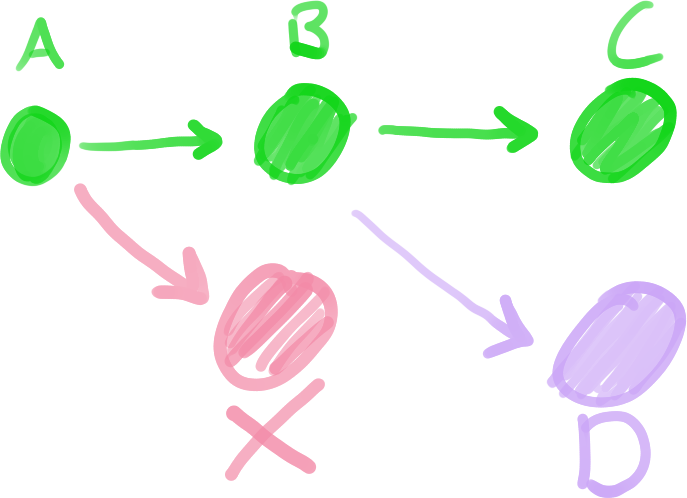

### İçerik
1. [Git'e Giriş](01-git.md)
2. [Temel Git Kullanımı](02-kullanim.md)
3. Git ile İşbirliği
    1. [Hazırlıklar](#3i-hazırlıklar)
    2. [İlk Merge Request](#3ii-i̇lk-merge-request)
---

# 3. Git ile İşbirliği

Versiyon kontrol sistemlerinin en sık kullanıldığı alan tabii ki farklı yazılımcılarla aynı
anda işbirliği yapmaktır. Git'in de bu konuda pek bir farkı yok. Git repository'lerinizi
"***forge***" adı verilen sitelerde paylaşabilir, bu sitelerde işbirliği yapabilirsiniz. Ve
doğru tahmin ettiniz, GitHub da bir forge! Bu bölümde sizi Git kullanarak GitHub'daki bir projeye
katkı sağlamaya hazırlayacağız.

## 3.i. Hazırlıklar

İşbirliğinin en önemli şartlarından biri güvendir. Elbette biz birbirimize güveniyoruz, ancak
bundan GitHub'ın da haberi olması gerekiyor! GitHub'da commit'lerimizi paylaşırken veya onları
indirirken bazı kontrollerden geçmemiz gerekiyor. Bu kontrolleri GPG ve SSH diye ikiye ayıralım.
Bunların ne olduğunu spesifik olarak düşünmenize pek fazla gerek yok, ancak çok kısaca şöyle anlatacağım:
GPG sizin commit'i yapan kişi olduğunuzu, SSH sizin commit'i paylaşan kişi olduğunuzu teyit eden sistemler.
GitHub kullanırken kafamızın rahat olması için bu iki sistemi de ayarlamamız gerekiyor.

**Bu kısımdaki hazırlıkları ilk kullandığınızda yalnızca bir kere yapmalısınız.**

### SSH

SSH daha önemli olduğu için ilk SSH ile başlayalım, ki aslında SSH'i ayarlamak daha kolay zaten. Herhangi
bir yerde terminalinizi açıp şu komudu girin.

```bash
$ ssh-keygen -t ed25519 -C "<Mail Adresiniz>"
```

Bu komut çalışırken size dosyanın nereye kaydedilmesi gerektiğini sorabilir. Bu soruda hiçbir şey yazmayıp
direkt `Enter`'a basın. Daha sonrasında parola isteyecek, kendinize göre bir parola belirleyip yazabilirsiniz.
Korkmayın, parola aşamasında ekrana bir şey yazmıyormuş gibi gözükse de aslında yazıyor, doğru girdiğinize emin
olun yeter.

Tebrikler, SSH anahtarınızı oluşturdunuz! Bu noktadan sonra herkese açık anahtarınızı kopyalayıp [buradan] GitHub
hesabınıza eklemelisiniz. Açık anahtarınızı görüntülemek için aşağıdaki komudu kullanabilirsiniz, sonra kopyalarsınız.

```bash
$ cat ~/.ssh/id_ed25519.pub
```

Açık anahtarınız şöyle bir şeye benzemeli:

```
ssh-ed25519 AAAAC3NzaC1lZDI1NTE5AAAAILKGzc555KV7pUTROkFeQK1ms5XSlEHytCH02vPGI5cf contact@sena.pink
```

### GPG

Yine aynı şekilde terminalimizi açıp komudumuzu girerek başlayalım.

```bash
$ gpg --full-generate-key
```

Bu aşamada adınız, mail adresiniz ve parola dışındaki bütün sorulara hiçbir şey yazmadan `Enter`'a basabilirsiniz.
Parolanızı yazarken yine gözükmeyebilir, siz yazın yine de. Şimdi sıradaki komudu yazarak anahtar ID'nizi öğrenin.

```bash
$ gpg --list-secret-keys --keyid-format=long
```

Bunun sonucunda elde edeceğiniz şey şöyle bir şey olacak:

```
---------
sec   ed25519/D0147D14A6B4F0C5 2024-06-18 [C] [expires: 2029-06-17]
      41DECBC393E7DB28759F6245D0147D14A6B4F0C5
uid                 [ unknown] Sena <contact@sena.pink>
```

Buradaki `sec`'ten sonraki ilk `/`'tan sonraki metin sizin anahtar ID'niz, yukarıdaki örnekte `D0147D14A6B4F0C5`.
Onu kopyalayınız, sıradaki komutlarda kullanacağız.

```bash
$ git config --global user.signingkey "<Anahtar ID'si>"
$ git config --global commit.gpgsign true
$ git config --global tag.gpgSign true
```

Tebrikler, bu da hazır! Ama tabii bunu da GitHub'a haber etmemiz gerek. Aşağıdaki komudu kullanarak GPG anahtarınızı
paylaşmaya hazır hâle getirin, ardından `-----BEGIN PGP PUBLIC KEY BLOCK-----` ile başlayıp
`-----END PGP PUBLIC KEY BLOCK-----` yazısının sonuna kadar her şeyi kopyalayıp GitHub'daki [bu] kısımdan
hesabınıza ekleyin.

```bash
$ gpg --armor --export "<Anahtar ID'si>"
```

## 3.ii. İlk Merge Request

Buraya kadar her şeyi doğru yaptıysanız GitHub'daki bir projeye katkıda bulunmaya hazırsınız demektir. Bu
oryantasyon kapsamında sizden istediğimiz, bu oryantasyonu şu an okuduğunuz bu projeye katkıda bulunmanız!
Tabii ki nasıl yapacağınızı anlayarak başlayalım.

İlk olarak biraz geri gidelim ve şunu hatırlayalım: Sağlıklı bir şekilde işbirliği yapabilmemiz için herkesin
ayrı bir dalda çalışması gerekiyor, ve bu en temel kurallardan biri. Bu yüzden yapmanız gereken ilk şey, bizim
repository'mizi "***fork***"lamak, yani kendi kopyanızı oluşturmak. Bunu repository'nin [ana sayfa]sında yukarıda
bulunan `Fork` tuşunu kullanarak yapabilirsiniz. Forklarken ismi, açıklamayı falan değiştirmenize gerek yok, direkt
onaylayın gitsin.

Forklama işlemini yaptıktan sonra GitHub'da kendi hesabınızda bir repository'niz olacak. Eğer doğru yaptıysanız,
repository'nin `kullanıcı-adınız/onboarding` şeklinde olması gerekiyor (örnek: `jn-sena/onboarding`). Bunu kullanarak
repository'mizi indirebiliriz. İndirmek istediğiniz dizinde bir terminal açıp şu komudu girelim. Kullanıcı adınızın
yerine doğrusunu yazmayı unutmayın! İlk komut SSH parolası isteyecektir, SSH parolanızı giriniz. **Bunu da repository
başına bir kere yapmanız gerekiyor, daha sonraki seferlerde direkt `onboarding` dizinini bilgisayarınızda bulup
terminalde açabilirsiniz.**

```bash
$ git clone "git@github.com:aaltebigep/onboarding.git"
$ cd onboarding
$ git remote add fork "git@github.com:<Kullanıcı Adı>/onboarding.git"
```



Şimdi burası biraz önemli. Değişiklik yapmaya henüz hazır değiliz. Önce kendi dalımızı oluşturmamız gerekiyor ancak
bunu yapmadan önce mümkün olan en son değişiklikte olduğumuzdan emin olmalıyız, aksi takdirde B değil A'dan bir dal
oluşturabilir ve geri kalabiliriz. Bu yüzden hemen *asıl projedeki değişiklikleri* indirelim. Eğer kılavuzu birebir
takip ettiyseniz, asıl projenin olduğu yerin adı "***origin***," diyagramdaki asıl yeşil dalın adı ise "***main***."
**Bu kısmı oluşturduğunuz her dal için bir kere yapmalısınız, aynı dalda devam edecekseniz tekrar yapmanıza hacet
yok.**

```bash
$ git checkout main
$ git pull origin main
```

Değişiklikleri aldığımıza göre dalımızı oluşturabiliriz. Bu örnekte branch'ın adını `degisiklik` koyalım. Eğer aynı
daldan devam edecekseniz bu komudu atlayabilirsiniz.

```bash
$ git checkout -b degisiklik
```

Şu an hangi dalda olduğunuzu aşağıdaki komut ile teyit edebilirsiniz, yanında `*` olan satır olduğunuz branch'ı temsil ediyor.

```bash
$ git branch
```

Şimdi değişiklik yapmaya hazırsınız! Oryantasyonumuzun görevi olarak sizden yapmanızı beklediğimiz değişiklik, repository'nin
başında bulunan [`/members.yml`]'ye önceki örneklerde olduğu gibi yeni bir satır ekleyip kendi GitHub kullanıcı adını yazmanız.
Bunu yaptıktan sonra dosyayı kaydedip, **[2. bölümde] gördüğümüz şekilde bir commit oluşturun ve aşağıdan devam edin**.

Commit'inizi oluşturduktan sonra bu commit'i kendi fork'unuza yüklemeniz gerekiyor. Bu işleme "***push***" diyoruz, yukarıda
yaptığımız "pull"un tersi ne de olsa. İlk ayarımızı yaparken forkunuzun terminaldeki adını da `fork` koymuştuk, dolayısıyla
`degisiklik` adındaki branch'ı push'lamak için şöyle bir komut kullanabiliriz:

```bash
$ git push fork degisiklik
```

Tebrikler! Artık yaptığınız değişiklikler GitHub hesabınızdaki fork'unuzda bulunuyor. Bu noktada eğer yapacağınız daha
fazla değişiklik ve commit varsa, gidip onları yapabilirsiniz. Bu oryantasyonun kapsamında sizden beklediğimiz daha fazla
değişiklik yok. Ancak hâlâ yapmanız gereken bir şey var: değişikliklerinizi bizim repository'miz ile birleştirmek! Bunun
için "***merge request***" (veya daha yaygın adıyla "***pull request***") oluşturmanız gerekiyor. Bunun için repository
sayfamızın [PR bölümünden] yeni bir PR oluşturabilirsiniz. Compare kısmını kendi fork'unuzun ilgili branch'ı yaptığınızdan
emin olun. Ardından tatlı bir açıklama yazıp bir PR oluşturun!

PR'ınızı oluşturduktan sonra ilgili projenin ***maintainer***ları yani yöneticileri sizin PR'ınızı inceleyip bir ***review***
bırakacaktır. Bu review'a göre eğer sizden bir değişiklik talep ederlerse, bu değişiklikleri yerine getirmeniz önemli. Eğer
buna ihtiyaç görülmezse, PR'ınız kabul edilecek ve branch'ınız ilgili proje ile birleştirilecektir!

Bu repository'ye yaptığınız PR'ın kabul edilmesi ve [`/members.yml`] dosyasında kullanıcı adınızın bulunması hâlinde oryantasyonu
başarı ile tamamladığınız kabul edilecektir.

---

> Oryantasyonu tamamladınız!
> [Ana sayfaya dön](https://github.com/aaltebigep/onboarding)

[buradan]: https://github.com/settings/ssh/new
[bu]: https://github.com/settings/gpg/new
[ana sayfa]: https://github.com/aaltebigep/onboarding
[`/members.yml`]: ../members.yml
[2. bölümde]: 02-kullanim.md#2ii-i̇lk-commit
[PR bölümünden]: https://github.com/aaltebigep/onboarding/pulls
